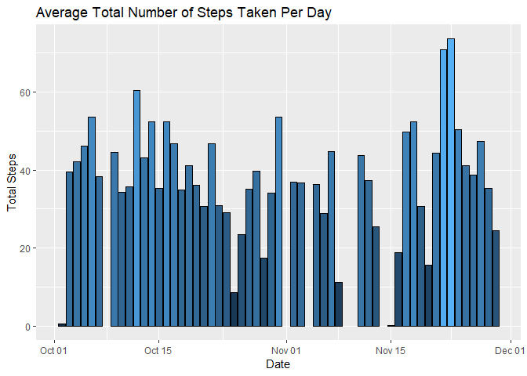
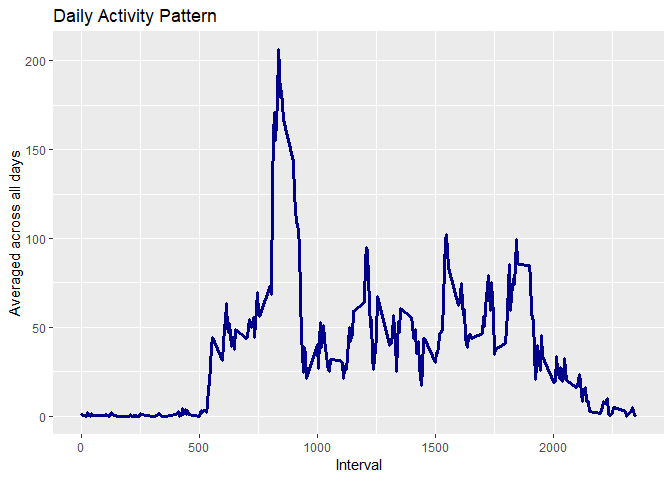
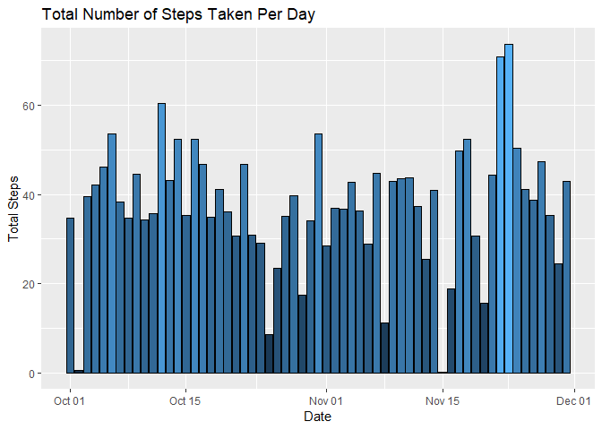
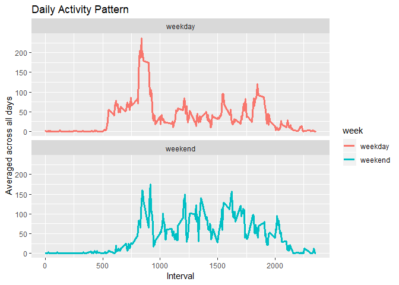

It is now possible to collect a large amount of data about personal movement using activity monitoring devices such as a Fitbit, Nike Fuelband, or Jawbone Up. These type of devices are part of the "quantified self" movement - a group of enthusiasts who take measurements about themselves regularly to improve their health, to find patterns in their behavior, or because they are tech geeks. But these data remain under-utilized both because the raw data are hard to obtain and there is a lack of statistical methods and software for processing and interpreting the data.

This assignment makes use of data from a personal activity monitoring device. This device collects data at 5 minute intervals through out the day. The data consists of two months of data from an anonymous individual collected during the months of October and November, 2012 and include the number of steps taken in 5 minute intervals each day.


```r
activityL <- read_csv("activity.csv")
```

```
## Parsed with column specification:
## cols(
##   steps = col_double(),
##   date = col_date(format = ""),
##   interval = col_double()
## )
```

```r
activityL <- activityL %>% mutate(Day=weekdays(date))
activityL <- activityL%>% mutate(week = ifelse(Day %in% c("Sunday","Saturday"),"weekend","weekday"))
```


wide version of the data


```r
activityW <- spread(activityL,interval,steps)
```

##What is the average total number of steps taken per day?


```r
totalsteps <- activityL %>% group_by(date) %>%
  summarise(steps=mean(steps))

ggplot(totalsteps,aes(date,steps,fill=steps))+
  geom_histogram(stat = "identity",color="black",)+
  labs(x="Date",y="Total Steps")+
  theme(legend.position = "none")+
  ggtitle("Average Total Number of Steps Taken Per Day")
```

<!-- -->


The Mean across all days

median(totalsteps$steps,na.rm = TRUE)

```r
mean(totalsteps$steps,na.rm = TRUE)
```

```
## [1] 37.3826
```

The Median across all days

```r
median(totalsteps$steps,na.rm = TRUE)
```

```
## [1] 37.37847
```


## What is the average daily activity pattern?

```r
interval <- activityL %>%group_by(interval) %>%
  summarise(mean=mean(steps,na.rm = TRUE))

ggplot(interval,aes(interval,mean))+
  geom_line(size=1.2,color="darkblue")+
  labs(x="Interval",y="Averaged across all days") +
  ggtitle("Daily Activity Pattern")
```

<!-- -->

Max 5 minutes interval 


```r
interval[which.max(interval$mean),]$interval
```

```
## [1] 835
```


# Dealing With NA


Calculating the number of days with missing data

```r
sum(is.na(activityW[4]))
```

```
## [1] 8
```


Imputing missing values through calculating the average steps per day per interval and merging the results with the activities data frame

```r
activity_temp<- activityW %>% group_by(Day)%>%
   summarise_all(funs(mean(.,na.rm = TRUE)))


activity_temp2<- activityW[!complete.cases(activityW),c(1,2,3)]
activity_temp<-activity_temp[c(-2,-3)]

merged <- merge(activity_temp2,activity_temp,by="Day")
merged <- merged[c(2,1,3:ncol(merged))]
```

Row binding and arranging the data by date

```r
activityW2 <- activityW[complete.cases(activityW),]

activityW2 <- rbind(activityW2,merged)

activityW2 <- activityW2 %>% arrange(date)
```


Creating long data after fixing NA's

```r
activityL2 <- gather(activityW2,key ="interval",value="steps",-date,-Day,-week)
```

# Calculating mean and plotting  the fixed data

```r
totalsteps2 <- activityL2 %>% group_by(date) %>%
  summarise(steps=mean(steps))

ggplot(totalsteps2,aes(date,steps,fill=steps))+
  geom_histogram(stat = "identity",color="black",)+
  labs(x="Date",y="Total Steps")+
  theme(legend.position = "none")+
  ggtitle("Total Number of Steps Taken Per Day")
```

<!-- -->


Mean = 

```r
mean(totalsteps2$steps)
```

```
## [1] 37.57364
```


Median = 

```r
median(totalsteps2$steps)
```

```
## [1] 38.24653
```
##Are there differences in activity patterns between weekdays and weekends?

Plotting Daily Activity Pattern 

```r
activityL2$interval <- as.numeric(activityL2$interval)
interval2 <- activityL2 %>%group_by(interval,week) %>%
  summarise(mean=mean(steps))


ggplot(interval2,aes(interval,mean,col=week))+
  geom_line(size=1.2)+
  labs(x="Interval",y="Averaged across all days") +
  ggtitle("Daily Activity Pattern")+
  facet_wrap(~week,nrow = 2)
```

<!-- -->


